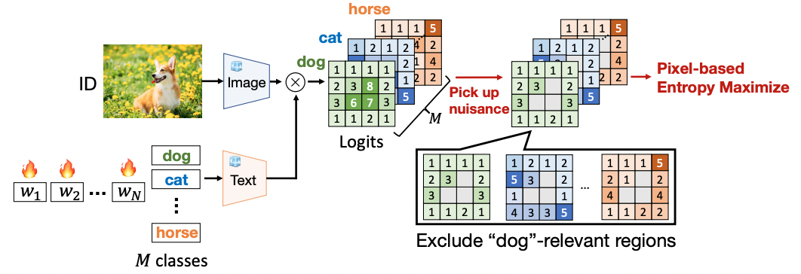
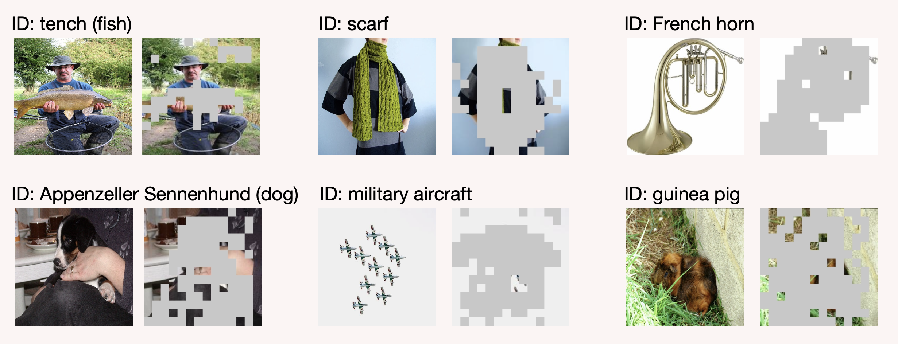

# LoCoOp: Few-Shot Out-of-Distribution Detection via Prompt Learning (NeurIPS2023)

This repository contains PyTorch implementation for our paper: [LoCoOp: Few-Shot Out-of-Distribution Detection via Prompt Learning](https://arxiv.org/abs/2306.01293)

### Abstract
We introduce a novel OOD detection approach called **Lo**cal regularized **Co**ntext **Op**timization (**LoCoOp**), which performs OOD regularization that utilizes the portions of CLIP local features as OOD features during training. CLIP's local features have a lot of ID-irrelevant nuisances (e.g., backgrounds), and by learning to push them away from the ID class text embeddings, we can remove the nuisances in the ID class text embeddings and enhance the separation between ID and OOD. Experiments on the large-scale ImageNet OOD detection benchmarks demonstrate the superiority of our LoCoOp over zero-shot, fully supervised detection methods and prompt learning methods. Notably, even in one shot setting -- just one label per class, LoCoOp outperforms existing zero-shot and fully supervised detection methods.

## News
2024/04/14: We added related work for CLIP-based parameter-efficient OOD detection so that we can easily follow this research area!     
2023/09/22: We publish the code for training and evaluation.   
2023/06/02: We make this repository public.


## Requirement
### Package
Our experiments are conducted with Python 3.8 and Pytorch 1.8.1.

All required packages are based on [CoOp](https://github.com/KaiyangZhou/CoOp) (for training) and [MCM](https://github.com/deeplearning-wisc/MCM) (for evaluation).
This code is built on top of the awesome toolbox [Dassl.pytorch](https://github.com/KaiyangZhou/Dassl.pytorch) so you need to install the `dassl` environment first. Simply follow the instructions described [here](https://github.com/KaiyangZhou/Dassl.pytorch#installation) to install `dassl` as well as PyTorch. After that, run `pip install -r requirements.txt` under `LoCoOp/` to install a few more packages required by [CLIP](https://github.com/openai/CLIP) and [MCM](https://github.com/deeplearning-wisc/MCM) (this should be done when `dassl` is activated).


### Datasets
Please create `data` folder and download the following ID and OOD datasets to `data`.

#### In-distribution Datasets
We use ImageNet-1K as the ID dataset.
- Create a folder named `imagenet/` under `data` folder.
- Create `images/` under `imagenet/`.
- Download the dataset from the [official website](https://image-net.org/index.php) and extract the training and validation sets to `$DATA/imagenet/images`.
  
Besides, we need to put `imagenet-classes.txt` under`imagenet/data` folder. This .txt file can be downloaded via https://drive.google.com/file/d/1-61f_ol79pViBFDG_IDlUQSwoLcn2XXF/view

#### Out-of-distribution Datasets
We use the large-scale OOD datasets [iNaturalist](https://arxiv.org/abs/1707.06642), [SUN](https://vision.princeton.edu/projects/2010/SUN/), [Places](https://arxiv.org/abs/1610.02055), and [Texture](https://arxiv.org/abs/1311.3618) curated by [Huang et al. 2021](https://arxiv.org/abs/2105.01879). We follow instructions from this [repository](https://github.com/deeplearning-wisc/large_scale_ood#out-of-distribution-dataset) to download the subsampled datasets.

The overall file structure is as follows:
```
LoCoOp
|-- data
    |-- imagenet
        |-- imagenet-classes.txt
        |-- images/
            |--train/ # contains 1,000 folders like n01440764, n01443537, etc.
            |-- val/ # contains 1,000 folders like n01440764, n01443537, etc.
    |-- iNaturalist
    |-- SUN
    |-- Places
    |-- Texture
    ...
```

## Pre-trained Models
We share the 16-shot pre-trained models for LoCoOp. Please download them via the [url](https://drive.google.com/drive/folders/1QX0z15cq5K2G7mKUEKitsz3P94UBMqPk?usp=sharing).

## Quick Start
### 1. Training
The training script is in `LoCoOp/scripts/locoop/train.sh`.

e.g., 1-shot training with ViT-B/16
```train
CUDA_VISIBLE_DEVICES=0 bash scripts/locoop/train.sh data imagenet vit_b16_ep50 end 16 1 False 0.25 200
```

e.g., 16-shot training with ViT-B/16
```train
CUDA_VISIBLE_DEVICES=0 bash scripts/locoop/train.sh data imagenet vit_b16_ep50 end 16 16 False 0.25 200
```

### 2. Inference 
The inference script is in `LoCoOp/scripts/locoop/eval.sh`.

If you evaluate the model of seed1 created by the above 16-shot training code, please conduct the below command.
```eval
CUDA_VISIBLE_DEVICES=0 bash scripts/locoop/eval.sh data imagenet vit_b16_ep50 1 output/imagenet/LoCoOp/vit_b16_ep50_16shots/nctx16_cscFalse_ctpend/seed1
```
The average scores of three seeds (1,2,3) are reported in the paper.

### 3. Visualization
The code for the visualization of extracted OOD regions is in `LoCoOp/scripts/locoop/demo_visualization.sh`.

e.g., image_path=data/imagenet/images/train/n04325704/n04325704_219.JPEG, label=824
```
sh scripts/locoop/demo_visualization.sh /home/miyai/LoCoOp/data imagenet vit_b16_ep50 output/imagenet/LoCoOp/vit_b16_ep50_16shots/nctx16_cscFalse_ctpend/seed1 data/imagenet/images/train/n04325704/n04325704_219.JPEG 824
```
The visualization result is in `visualization/`.

The visualization examples are below:


## Acknowledgement
We adopt these codes to create this repository.
* [Conditional Prompt Learning for Vision-Language Models](https://arxiv.org/abs/2203.05557), in CVPR, 2022.
* [Learning to Prompt for Vision-Language Models](https://arxiv.org/abs/2109.01134), IJCV, 2022.
* [Delving into Out-of-Distribution Detection with Vision-Language Representations](https://proceedings.neurips.cc/paper_files/paper/2022/hash/e43a33994a28f746dcfd53eb51ed3c2d-Abstract-Conference.html), in NeurIPS, 2022
* [Zero-Shot In-Distribution Detection in Multi-Object Settings Using Vision-Language Foundation Models](https://arxiv.org/abs/2304.04521), arXiv, 2023


## Subsequent work for Parameter-Efficient OOD detection methods
Parameter-efficient OOD detection is a promising research direction, and LoCoOp can be a baseline approach for this field.  
To catch up with this field, we summarized the subsequent work for CLIP-based efficient OOD detection methods. (Last update: 2024.04.14)  

1. [](https://link.springer.com/article/10.1007/s11263-023-01895-7), [code](https://github.com/deeplearning-wisc/MCM)
    > This is the journal extension version of [MCM](https://proceedings.neurips.cc/paper_files/paper/2022/hash/e43a33994a28f746dcfd53eb51ed3c2d-Abstract-Conference.html). This paper examines the effectiveness of MCM with vanilla prompt learning methods (e.g., CoOp).
    > To implement this, you can utilize our LoCoOp's code following [the minor change](https://github.com/AtsuMiyai/LoCoOp/issues/2#issuecomment-1923390359).
2. [](https://openreview.net/pdf?id=nanyAujl6e)
   > LSN learns negative prompts for OOD detection, which is an orthogonal approach to LoCoOp and [can be combined with LoCoOp](https://openreview.net/forum?id=nanyAujl6e&referrer=%5Bthe%20profile%20of%20Jun%20Nie%5D(%2Fprofile%3Fid%3D~Jun_Nie1)).
3. [](https://arxiv.org/abs/2311.15243), [code](https://github.com/ycfate/ID-like)
   > IDPrompt leverages ID-like outliers in the ID image to further leverage the capabilities of CLIP for OOD detection, which is a similar concept to LoCoOp.
4. [](https://arxiv.org/abs/2312.01732), [code](https://github.com/LuFan31/LSA)
   > LSA first tackled [full-spectrum OOD detection](https://arxiv.org/abs/2204.05306) in the context of CLIP-based parameter-efficient OOD detection.
5. [](https://arxiv.org/abs/2404.03248), [code](https://github.com/mala-lab/negprompt)
   > NegPrompt learns a set of negative prompts with only ID data. Also, this paper tackled a novel promising problem setting called Open-vocabulary OOD detection. 

If I missed some work, feel free to contact me by opening an issue! 

## Citaiton
If you find our work interesting or use our code/models, please consider citing:
```bibtex
@inproceedings{miyai2023locoop,
  title={LoCoOp: Few-Shot Out-of-Distribution Detection via Prompt Learning},
  author={Miyai, Atsuyuki and Yu, Qing and Irie, Go and Aizawa, Kiyoharu},
  booktitle={Thirty-Seventh Conference on Neural Information Processing Systems},
  year={2023}
}
```

Besides, when you use GL-MCM (test-time detection method), please consider citing:
```bibtex
@article{miyai2023zero,
  title={Zero-Shot In-Distribution Detection in Multi-Object Settings Using Vision-Language Foundation Models},
  author={Miyai, Atsuyuki and Yu, Qing and Irie, Go and Aizawa, Kiyoharu},
  journal={arXiv preprint arXiv:2304.04521},
  year={2023}
}
```
